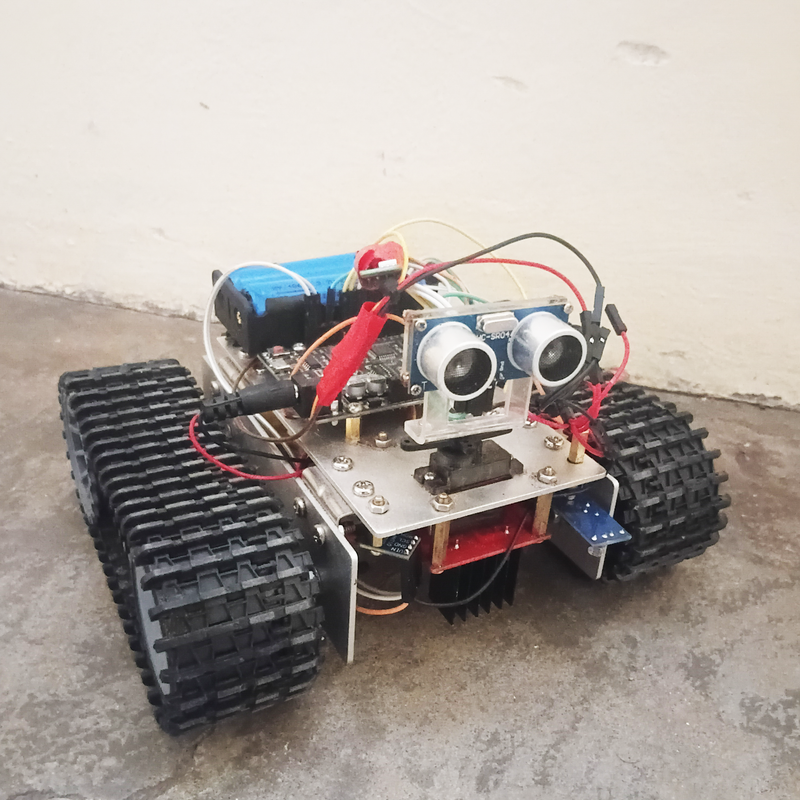
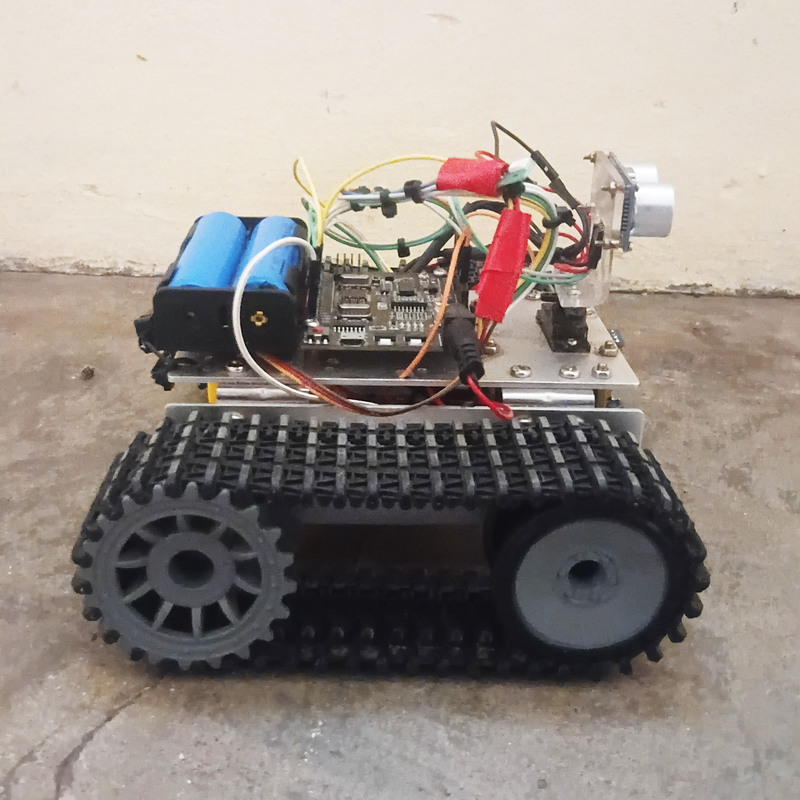
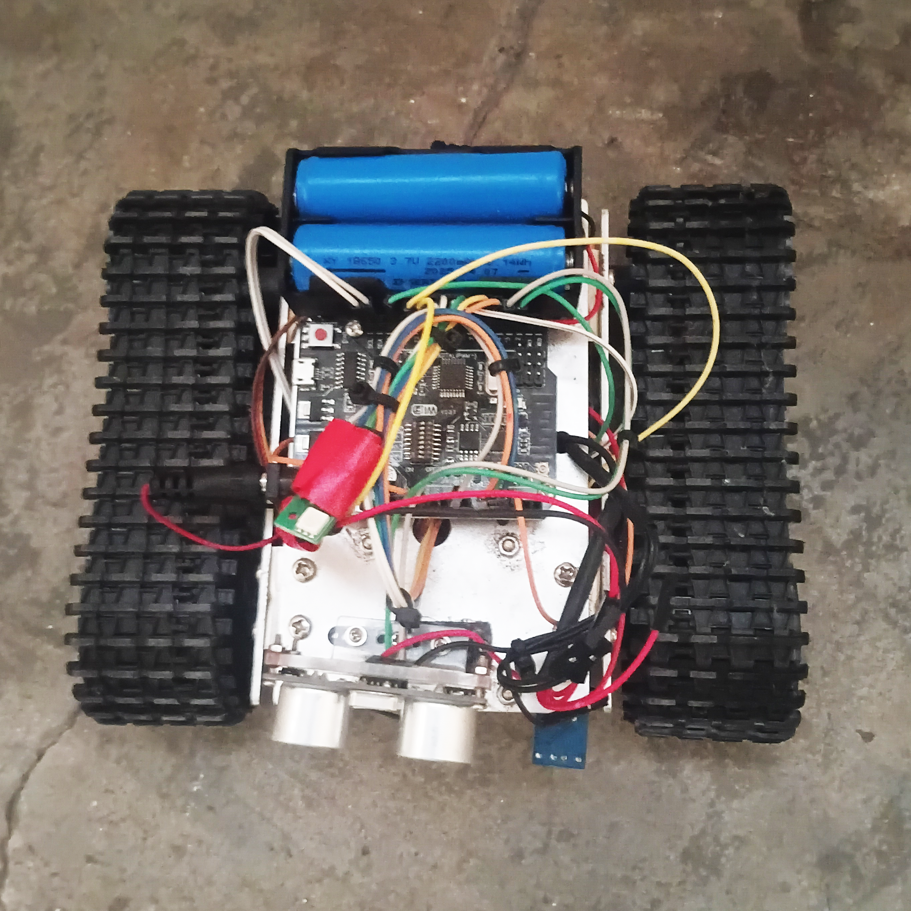

[](https://x.com/NorowaretaGemu)
[](https://opensource.org/licenses/MIT)

<div align="center">
  <a href="https://ko-fi.com/cursedentertainment">
    
  </a>
</div>
<div align="center">
  
</div>

<div align="center">
  
</div>

<div align="center">
  
  
</div>


---

# MILA
## MINIATURE INTEGRATED LOGIC AUTOMATON
### A DREAM Robotics Agent

- Robot Type: Tank

<div align="center">
  
  
  
  
</div>

---

### Software
- [Arduino IDE](https://docs.arduino.cc/software/ide/)

---

## Related Projects (DREAM Robotics Ecosystem)

- [WHIP-Robot-v00](https://github.com/CursedPrograms/WHIP-Robot-v00)
- [KIDA-Robot-v00](https://github.com/CursedPrograms/KIDA-Robot-v00)
- [KIDA-Robot-v01](https://github.com/CursedPrograms/KIDA-Robot-v01)
- [NORA-Robot-v00](https://github.com/CursedPrograms/NORA-Robot-v00)
- [IDA-Robot-v01](https://github.com/CursedPrograms/IDA-Robot-v00)
- [ARM-Robot-v01](https://github.com/CursedPrograms/ARM-Robot-v01)
- [RIFT](https://github.com/CursedPrograms/RIFT)
- [DREAM](https://github.com/CursedPrograms/DREAM)

---

## Overview

**Website: <https://cursedprograms.github.io/MILA/>**

MILA is a small tank-chassis robot you can drive over WiFi. It hosts its own web dashboard, streams live sensor data, and can steer itself around obstacles.

- **Drive modes:** WASD (car-style), TANK (independent tracks) and OBSTACLE (autonomous).
- **Live telemetry:** front, left and right distance, temperature, humidity and the last IR remote key.
- **WiFi dashboard:** served by the ESP8266 on port `5010`. MILA hosts her own access point at `192.168.4.1`, or joins NORA's network in fleet mode.
- **Safety:** a collision guard force-stops the robot in manual modes, and a watchdog stops it if the connection drops.
- **Speed:** cycle 100 / 75 / 50 / 25 % from the IR remote, or set an exact value from the dashboard slider.

---

## Hardware

- Small Tank Robot Chassis
- Arduino Bluetooth (Integrated ESP8266)
- 2S 18650
- L298N
- MG95 Servo
- Ultrasonic Sensor
- 5V DC Motors
- RGB LED
- Temperature & Humidity Sensor
- IR Receiver

---

## Quick start

### DIP switches (UNO + WiFi R3 board)

The board's 8 DIP switches choose what the USB port and the two chips are connected to. Switch 8 is unused.

| What you're doing | 1 | 2 | 3 | 4 | 5 | 6 | 7 | 8 |
|---|---|---|---|---|---|---|---|---|
| **Running MILA** (Arduino ↔ ESP8266) | ON | ON | off | off | off | off | off | off |
| **Upload `scripts/MILA`** (USB → ATmega328) | off | off | ON | ON | off | off | off | off |
| **Upload `scripts/esp8266`** (USB → ESP8266, flash mode) | off | off | off | off | ON | ON | ON | off |
| **ESP8266 Serial Monitor** (USB ↔ ESP8266) | off | off | off | off | ON | ON | off | off |
| USB ↔ ATmega328 ↔ ESP8266 all linked | ON | ON | ON | ON | off | off | off | off |

1. Set **3 + 4 ON** and upload `scripts/MILA`.
2. Set **5 + 6 + 7 ON** and upload `scripts/esp8266` (press reset if the upload won't start).
3. Set **1 + 2 ON**, everything else off, and power-cycle to drive her.

In the running setting the Arduino's serial goes to the ESP, not USB, so the Serial Monitor shows nothing. Use 3 + 4 to read her `DIST:` / `IR:` lines over USB.

> [!NOTE]
> Check this against the table printed on your board, as some clones differ slightly.

### Flash and connect

Flash the firmware from `scripts/esp8266` and `scripts/MILA` with the Arduino IDE (set the DIP switches above first), power the robot on, and join her WiFi network. Then open the dashboard in a browser, or run a desktop controller:

```
./run.sh                      # macOS / Linux / Git Bash
run.bat                       # Windows (cmd)
.\run.ps1                     # Windows (PowerShell)

./run.sh --host 192.168.4.1 --port 5010
```

If MILA joined NORA's network (fleet mode) she won't be at `192.168.4.1`. Press **SCAN NETWORK** in the C++, C# or F# controller, or start it with `--host auto`.

## Desktop controllers

Every controller lives in [`scripts/`](scripts) and has a build-and-run script in `.sh`, `.bat` and `.ps1` form.

| Language | UI toolkit | Run | Radar & graphs | Gamepad |
|---|---|---|:---:|:---:|
| Python | pygame | `run.sh` | | |
| C++ | Win32 / GDI | `scripts/run-cpp.*` | ✓ | ✓ |
| C# | WinForms | `scripts/run-csharp.*` | ✓ | ✓ |
| F# (preview) | WinForms | `scripts/run-fsharp.*` | ✓ | ✓ |
| Rust | egui | `scripts/run-rust.*` | | |
| Go | Ebitengine | `scripts/run-go.*` | | |
| Julia | GLMakie | `scripts/run-julia.*` | | |

**Controls** (all controllers): `1` `2` `3` switch mode, `WASD` / arrow keys drive, `Q` `A` `E` `D` drive the tracks in TANK mode, `Space` stops, `Esc` quits. Everything is also clickable.

**The C++, C# and F# controllers** also have a proximity radar, live distance / temperature / humidity graphs with CSV export, an exact speed slider, network discovery (`--host auto`), remembered host / port / mode, and Xbox gamepad support (stick or D-pad to drive, triggers for speed, `A` to stop, bumpers to change mode).

## Analyzing a session (Fortran)

The **EXPORT CSV** button saves the whole session to `Documents\MILA-telemetry`. `scripts/fortran/telemetry_stats.f90` turns an export into a report: sample rate, time in each drive mode, per-sensor min / max / mean / standard deviation, outliers (beyond 3σ), connection gaps and close calls (front distance under 20 cm). It needs `gfortran` and picks the newest export by default:

```
scripts/run-fortran.sh              # or run-fortran.bat / run-fortran.ps1
scripts/run-fortran.sh my_run.csv
```

## Training data: teach MILA to drive herself

Drive her around by hand (IR remote, keyboard, gamepad or the dashboard), press **EXPORT CSV**, and `scripts/fortran/make_dataset.f90` turns the sessions into a dataset for imitation learning: each row pairs what the ultrasonic sensor saw with what the human was doing.

```
scripts/run-dataset.sh      # every export -> Documents\MILA-telemetry\datasets\drive_policy.csv
scripts/run-dataset.sh out.csv session1.csv session2.csv
```

- **Only human driving is kept** (`wasd` and `tank` modes). Obstacle mode (she drives herself) and moments the collision guard overrode you are dropped.
- **The label is the real motor state.** The Arduino now reports `MOTOR:<left>,<right>` (each -1 / 0 / +1), so the label is the same whichever input you used. The IR remote moves the motors directly and never shows up as a web command, which is why this is needed. It maps to 9 classes: `STOP`, `FORWARD`, `BACKWARD`, `LEFT`, `RIGHT`, `L_FWD`, `L_BWD`, `R_FWD`, `R_BWD`.
- **Features:** front distance, how it is changing (`d_dist`, 5-sample average and minimum), speed and mode. `dist_valid` is 0 when the sensor returned no echo, in which case `dist` is carried over from the last good reading.
- **No data leakage:** every export is its own session, and the last 20 % of each is marked `split=val`.
- Left/right distances are **not** features: the firmware only measures them during the obstacle-mode scan, so in human-driven data they are stale.

Columns: `session,t_s,split,mode,mode_id,dist,dist_valid,d_dist,dist_avg5,dist_min5,speed,motor_l,motor_r,action,action_id,next_action,next_action_id`. `action` is what you were doing at that sample and `next_action` what you did one sample (about 0.4 s) later, so use whichever suits your model. Load it with pandas, or anything that reads CSV.

**Reflash both boards** (`scripts/MILA` and `scripts/esp8266`) to get the motor columns. Exports from older firmware still work, but their labels come from the last web command only, so IR driving is invisible in them. The same reflash also makes the front sensor sample continuously in manual modes, so the distance no longer goes stale while you are stopped or turning.

## Testing without a robot

`scripts/sim` holds a mock MILA that serves the same endpoints as the firmware with simulated sensor data:

```
scripts/run-sim.sh
scripts/run-cpp.sh --host 127.0.0.1
```

<br>
<div align="center">© Cursed Entertainment 2026</div>
<br>
<div align="center">
  <a href="https://cursed-entertainment.itch.io/" target="_blank">
    
  </a>
</div>
<br>
<div align="center">
  <a href="https://github.com/SynthWomb" target="_blank">
    
  </a>
</div>
